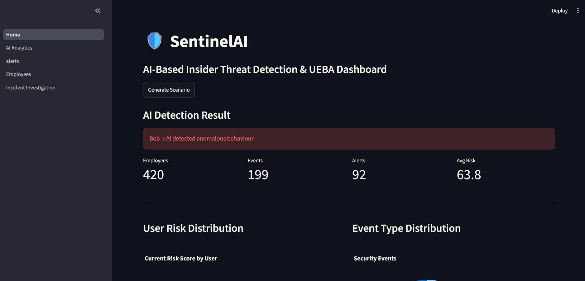
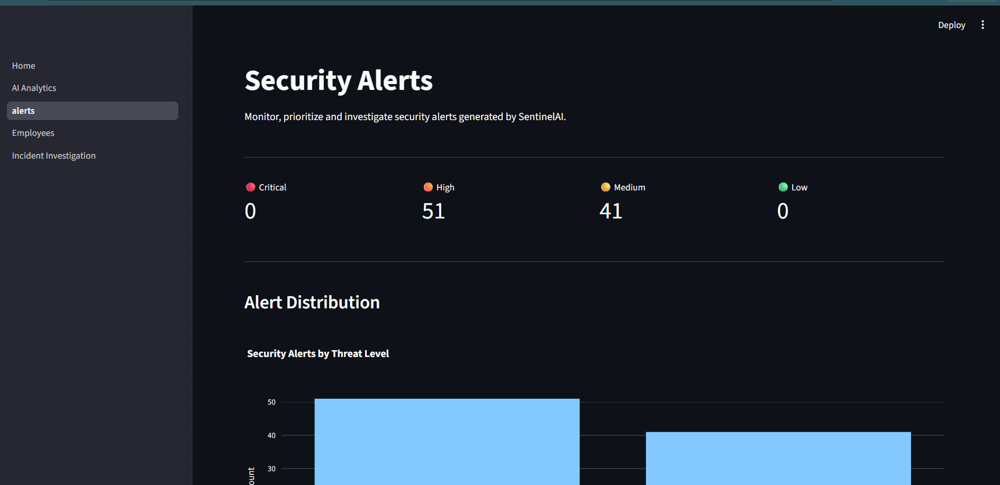
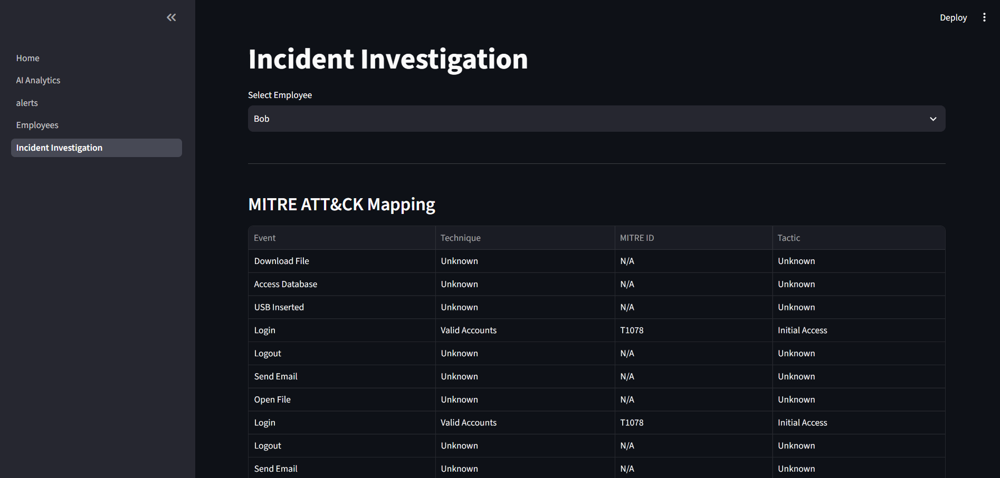
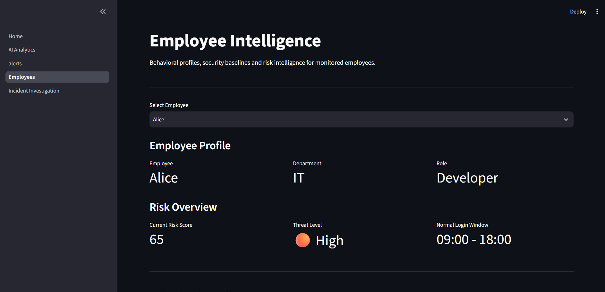
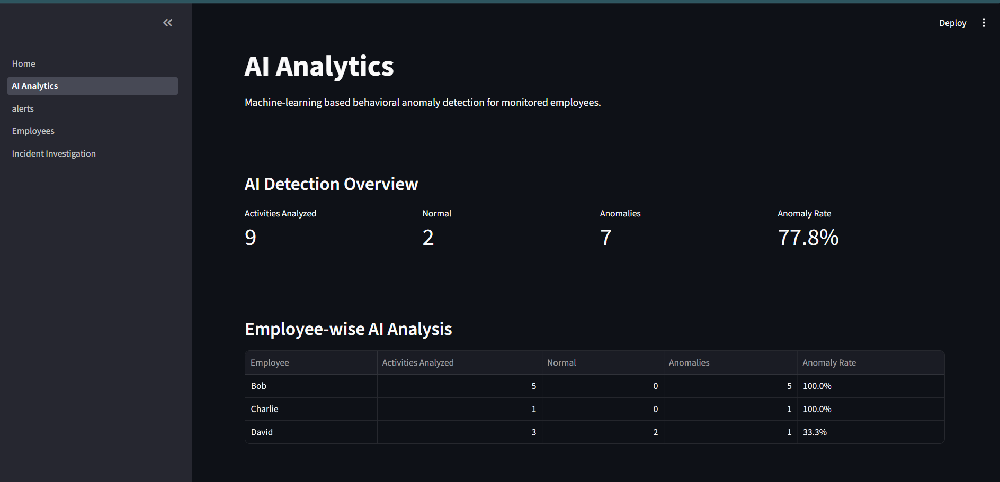

# 🛡️ SentinelAI — AI-Based Internal Threat Detection System

SentinelAI is an AI-powered cybersecurity and User and Entity Behavior Analytics (UEBA) application designed to detect potential insider threats by analyzing employee behavior, identifying anomalies, calculating behavioral risk scores, and generating security alerts.

The system simulates employee activities and provides a centralized security dashboard for monitoring suspicious behavior, investigating incidents, analyzing behavioral deviations, mapping activities to MITRE ATT&CK techniques, and generating incident reports.

---

## 🚀 Features

### 🏠 Security Dashboard

- Generate simulated employee activity scenarios
- Monitor employees, events, alerts, and average risk
- View user risk distribution
- Analyze security event distribution
- Monitor recent employee activity
- View top-risk employees

### 🤖 AI-Powered Anomaly Detection

- Machine-learning-based behavioral anomaly detection
- Analyzes multiple behavioral features together
- Detects activities classified as **Normal** or **Anomalous**
- Stores historical AI analysis results
- Provides employee-wise anomaly statistics
- Calculates anomaly rates

Behavioral features include:

- Login hour
- Number of downloads
- Files opened
- USB usage
- Failed login attempts

### 🚨 Security Alerts

- Automatically generates alerts based on behavioral risk
- Supports Critical, High, Medium, and Low threat levels
- Filter alerts by employee
- Filter alerts by threat level
- View alert details and reasons
- MITRE ATT&CK technique mapping
- Alert distribution visualization
- Investigate employees directly from selected alerts

### 🔍 Incident Investigation

- Employee-wise incident investigation
- MITRE ATT&CK technique mapping
- Behavioral deviation analysis
- Attack and threat timelines
- Current risk assessment
- Historical risk trend visualization
- AI-generated behavioral explanations
- Investigation summary
- Generate downloadable PDF incident reports

### 👥 Employee Intelligence

- Employee profiles
- Department and role information
- Behavioral security baselines
- Normal login windows
- USB access policies
- Average downloads and files opened
- Employee activity history
- Current risk scores and threat levels
- Historical risk visualization

### 📊 Behavioral Risk Analysis

SentinelAI evaluates employee activity against established behavioral baselines to identify suspicious deviations.

The risk analysis considers factors such as:

- Unusual login times
- Excessive downloads
- Abnormal file access
- Unauthorized USB usage
- Failed login attempts

---

## 🛠️ Tech Stack

| Category | Technologies |
|----------|--------------|
| Programming Language | Python |
| Web Framework | Streamlit |
| Database | SQLite |
| Machine Learning | Scikit-learn |
| Data Processing | Pandas, NumPy |
| Data Visualization | Plotly |
| Cybersecurity Framework | MITRE ATT&CK |
| Report Generation | ReportLab |
| Version Control | Git & GitHub |

---

## 📂 Project Structure

```text
internal-threat-detection-system/
│
├── Home.py
├── requirements.txt
├── README.md
├── .gitignore
│
├── pages/
│   ├── Alerts.py
│   ├── Incident_Investigation.py
│   ├── Employees.py
│   └── AI_Analytics.py
│
├── database/
│   ├── database.py
│   └── schema.py
│
├── modules/
│   ├── activity_simulator.py
│   ├── anomaly_detector.py
│   ├── behavior_analyzer.py
│   ├── behavior_engine.py
│   ├── explanation_engine.py
│   ├── mitre_mapper.py
│   ├── report_generator.py
│   ├── risk_engine.py
│   └── timeline_engine.py
│
├── assets/
│   └── screenshots/
│
└── research/
    └── paper.pdf
```

> Note: The exact project structure may contain additional supporting files such as baseline initialization or database utilities.

---

## ⚙️ Installation

### 1. Clone the repository

```bash
git clone https://github.com/Achal112/internal-threat-detection-system.git
```

### 2. Move into the project directory

```bash
cd internal-threat-detection-system
```

### 3. Create a virtual environment

#### Windows

```bash
python -m venv .venv
.venv\Scripts\activate
```

#### Linux / macOS

```bash
python3 -m venv .venv
source .venv/bin/activate
```

### 4. Install dependencies

```bash
pip install -r requirements.txt
```

---

## ▶️ Run the Application

Start SentinelAI using:

```bash
streamlit run Home.py
```

The application will open in your default browser.

---

## 🔄 System Workflow

```text
Employee Activity Simulation
            ↓
      Event Storage
        (SQLite)
            ↓
   Behavioral Analysis
            ↓
   Risk Score Calculation
            ↓
    AI Anomaly Detection
            ↓
   Security Alert Generation
            ↓
   MITRE ATT&CK Mapping
            ↓
   Incident Investigation
            ↓
  Risk & Behavioral Analytics
            ↓
   PDF Incident Report
```

---

## 📊 Application Modules

| Module | Purpose |
|--------|---------|
| 🏠 Home | Security dashboard and scenario generation |
| 🚨 Alerts | Monitor, filter, and prioritize security alerts |
| 🔍 Incident Investigation | Analyze employee incidents and generate reports |
| 👥 Employee Intelligence | View employee profiles and behavioral baselines |
| 🤖 AI Analytics | Analyze anomaly detection results and trends |

---

## 📸 Screenshots

Screenshots can be added to the `assets/screenshots/` directory.

- Home Dashboard




- Security Alerts



  
- Incident Investigation



  
- Employee Intelligence




- AI Analytics




---

## 📖 Research Context

This project is based on the concept of behavior-aware insider threat detection using temporal user activity analysis and personalized behavioral baselines.

The system demonstrates how employee activity patterns can be analyzed to identify deviations from normal behavior and prioritize potentially risky activities for investigation.

Key concepts explored include:

- User and Entity Behavior Analytics (UEBA)
- Behavioral baselining
- Temporal activity analysis
- Risk scoring
- Machine learning-based anomaly detection
- Insider threat detection
- MITRE ATT&CK mapping

---

## 🔮 Future Enhancements

- Real-time log ingestion
- Integration with SIEM platforms
- Deep learning-based anomaly detection
- Automated threat response
- Email or notification alerts
- Role-Based Access Control (RBAC)
- Docker containerization
- Cloud deployment
- Integration with real enterprise security logs

---

## 💡 Skills Demonstrated

- Python Programming
- Object-Oriented Programming
- Machine Learning
- Anomaly Detection
- User and Entity Behavior Analytics (UEBA)
- Cybersecurity
- Insider Threat Detection
- Behavioral Risk Analysis
- MITRE ATT&CK Mapping
- SQLite Database Management
- Data Visualization
- Streamlit Development
- PDF Report Generation
- Software Design
- Git & GitHub

---

## 👩‍💻 Author

**Achal Laxman Deshmukh**

- LinkedIn: https://linkedin.com/in/deshmukhachal11
- GitHub: https://github.com/Achal112

---

## ⭐ Support

If you found this project interesting, consider giving the repository a ⭐ on GitHub.
